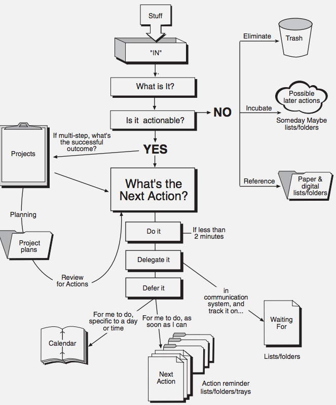
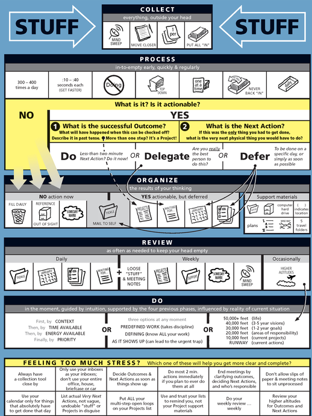
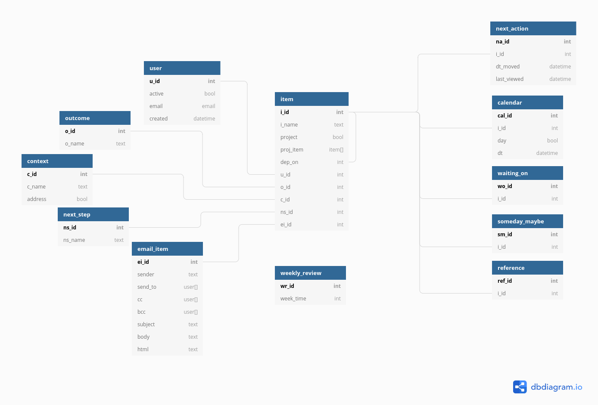

# 💍The Proposal 💒❤️

##  What goal will your website be designed to achieve? 
To implement a digital version of the *Getting Things Done*  method
***
##  What kind of users will visit your site? In other words, what is the demographic of your users?
This app will target the general population (consumers), as *Getting Things Done*  is meant to be used for general productivity in both  personal, familial, and professional realms. **That said:** *Getting Things Done*, as a **method**, is implemented by a select few people who have read the book *Getting Things Done* by David Allen
***
##  What data do you plan on using? You may have not picked your actual API yet, which is fine, just outline what kind of data you would like it to contain. 
### Tasks will have addresses
The Mapquest API can help with address correction, searching, and embedded maps
### Tasks and general app functions (e.g. weekly review) need reminders
Mailchimp or flask-email should suffice for this
### A means to speed up "add to inbox", "clarify task details", etc
speech-to-text (api undetermined)
### calendar
a calendar api would be nice
***
##  In brief, outline your approach to creating your project (knowing that you may not know everything in advance and that these details might change later). Answer questions like the ones below, but feel free to add more information: 
A general knowledge of the *Getting Things Done* workflow is needed (see images below). Much of the logic (and the database, for that matter) will depend on the workflows 

**Basic Workflow** 

**Advanced Workflow**

### What does your database schema look like?

### What kinds of issues might you run into with your API?

### Is there any sensitive information you need to secure?
Possibly app passwords to connect to peeps emails

### What functionality will your app include?
Everything indicated in the images above

### What will the user flow look like?
Like the image above (be sure to talk to Michael about how to show this (e.g. UML Diagram, Mind Map, interpretive dancing, etc))

### What features make your site more than CRUD? Do you have any stretch goals?
LOTS of functionality surrounding every model in the db. I will verbally explain more to Michael tonight, and find a more formal way to describe here.
